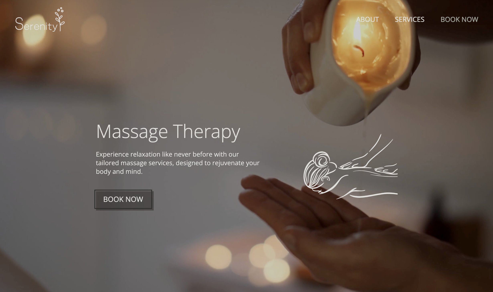

# Serenity Massage Therapy Website



Welcome to the Serenity Massage Therapy Hub! This project is a modern and user-friendly website designed for a massage therapy business, showcasing services, enabling bookings, and providing an exceptional online presence.

## Table of Contents

- [Features](#features)
- [Technologies Used](#technologies-used)
- [Installation](#installation)

---

## Features

- **Homepage**: A visually appealing landing page with an introduction to the business.
- **Services Page**: Details of available massage therapy services, categorized for user convenience.
- **Booking Page**: An easy-to-navigate booking system (placeholder for future development).
- **Responsive Design**: Optimized for viewing on desktops, tablets, and mobile devices.
- **Modern UI**: Clean, accessible, and user-friendly interface.
- **Custom Video Header**: Eye-catching background video to enhance the website's aesthetic.

---

## Technologies Used

- **HTML5**: For the structure and content of the website.
- **CSS3**: For styling, including global styles and responsive design.

---

## Installation

To run this project locally, follow these steps:

1. Clone this repository:
   ```bash
   git clone https://github.com/hsiangyichen/massage-therapy-hub.git
   ```
2. Open the `index.html` file in your browser to view the site.
